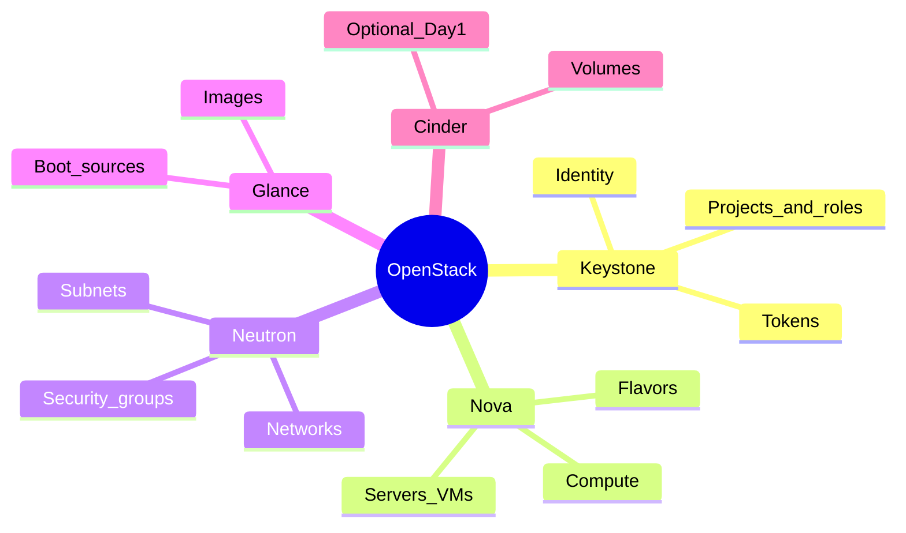

# OpenStack core services — Day 1 mental model



## Service map (simple → precise)

| Service | Job in one sentence | CLI you use today | Later DPaaS link |
|---------|---------------------|-------------------|------------------|
| **Keystone** | Issues tokens and decides who may call which API | `token issue`, `service list` | Same pattern as JWT / Databricks PAT |
| **Nova** | Creates and schedules compute instances | `server list`, `flavor list` | PaaS “instance” you CRUD in Week 3 |
| **Neutron** | Connects instances to networks and SGs | `network list` | Isolation for API / DB / jobs |
| **Glance** | Stores bootable images | `image list` | Reproducible base for VMs |
| **Cinder** | Attaches block volumes (optional Day 1) | `volume list` | Persistent DB disks later |

## Auth flow (what health_check proves)

```text
You (CLI)
  → Keystone (username/app-cred + project)
  → token
  → Nova / Neutron / Glance endpoints from the service catalog
```

If the token works but `network list` fails, the problem is usually **catalog/endpoint/region**, not your password.

## Healthy vs “installed”

- **Healthy (our definition):** authenticated token + catalog + at least network and image APIs respond.
- **Not required Day 1:** creating a VM (that is Day 3–4 Terraform).
